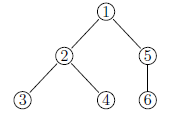

Computer Algebra System for .NET Framework
================================

# Introduction #

A computer algebra system (CAS) is a software program that facilitates symbolic mathematics. The core functionality of a CAS is manipulation of mathematical expressions in symbolic form. 
Usually, to perform such manipulations, the original data are represented as syntax trees and then they are transformed using some rules. The main aim of this project is to provide flexible and comfortable way to specify 
such transformation rules.

Many CAS systems are developed either small research projects and enterprise software. However, no one is implemented in .NET framework, which is a modern programming technology, widely used for research, 
education and software development. To our knowledge, only one .NET solution exists, named Math.NET. However, it could hardly considered as a full-fledged computer algebra system. 
Transformation rules are not programmed as a separate entity, and are substituted by Visitor pattern  that processes nodes in a tree according to its function. This decision hampers the system’s expanding, 
because addition of new operations demands alterations in the existed code. Moreover, even operations like the differentiation of the exponential function are still not implemented.

To develop a computer algebra system, we need to build convenient and reliable framework for rules definition and application. Such frameworks are the core part of all existed CAS. In this work, we present our solution 
for this task, based on .NET framework. We do not have an objective to write enterprise computer algebra software, because the market already has many solutions. However, we believe that our solution will be useful in 
research area, because it gives an opportunity to work with symbolic computations with a modern and effective programming languages. Also, as we will see below, .NET framework and C# language provides several syntax features,
 which facilitate definition of transformational rules. The usage such features for transformation rules programming gives a fresh look on symbolic computations, and could be resulted in new approaches to computer algebra systems.

# Rule definition #

Application of the rule can be subdivided into the three stages. In *sampling* stage, the system that applies rules (which will be called *driver* below) selects some tree-like structure from 
the syntax tree, and presents its nodes as a tuple. In *selection* stage, the driver sort out the tuples that do not meet the specified criteria. In third stage, called *modification*, the driver transforms 
the tree according to the rule. In the most widespread case, the rule processes one tree. For such *unary* rules, the original tree is copied, and then the copy is rearranged according to rule. In some cases, 
the rule processes more than one tree. For example, in logical interference modus ponens rule accepts two trees *A &rarr; B* and *A* and produces *B*. In this case, new tree is to be created and built with nodes 
copies from selected tuple. Since the driver always copies the nodes before manipulation, the corectness of initial trees is preserved. 

## Sampling ##
To perform the sampling stage, we should specify the tree-like structure we search in a tree. Also, we need to map the nodes in the structure into a tuple of nodes. We used query strings of our own syntax to do that. 
Let us demonstrate the syntax of query string with the following example. Consider syntax tree in the Figure 1. In the Table 1, we present various query string, along with corresponded selections and comments.

<table>
<caption>Table 1: Query string examples</caption>
<th>Query String</th><th>Tuples</th><th>Comment</th>
<tr><td>A</td><td>(1)</td><td>The root of the tree</td></tr>
<tr><td>?A</td><td>(1),(2),(3),(4),(5),(6)</td><td>An arbitrary node in a tree</td></tr>
<tr><td>?A(B)</td><td>(5,6)</td><td>An arbitrary node, that has only one child, and this child</td></tr>
<tr><td>?A(B,C)</td><td>(1,2,5), (2,3,4)</td><td>An arbitrary node in a tree with its two children in fixed order</td></tr>
<tr><td>?A(.B,.C)</td><td>(1,2,5), (1,5,2), (2,3,4), (2,4,3)</td><td>An arbitrary node with its two children in unconditioned order</td></tr>
<tr><td>?A(.B)</td><td>(1,2), (2,3), (2,4), (5,6)</td><td>An arbitrary node with its one child</td></tr>
<tr><td>?A(?B) </td><td>(1,2), (1,3), (1,4), (1,5), (1,6), (2,3), (2,4), (5,6)</td><td>An arbitrary node with its arbitrary descendant</td></tr>
<tr><td>?A(?B(?C))</td><td>(1,2,3), (1,2,4), (1,5,6)</td><td>An arbitrary node, its descendant and descendant of the descendant</td></tr>
<tr><td>?A(?B(C,D))</td><td>(1,2,3,4)</td><td>An arbitrary node that has a descendant with two child</td></tr>
</table>